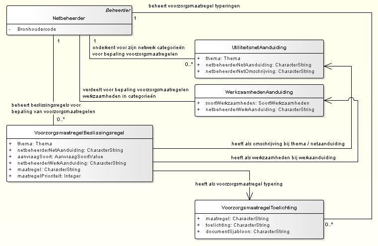
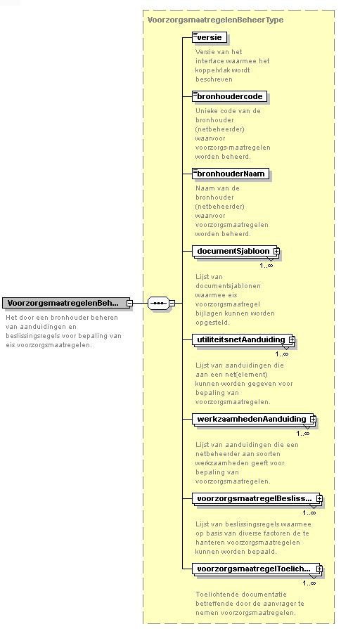

# Handreiking bij het invullen van de EV-beslissingsmatrix KLIC

**Inhoudsopgave**

- [Inleiding](#inleiding)
- [Actualiseren netinformatie en voorzorgsmaatregelen](#actualiseren-netinformatie-en-voorzorgsmaatregelen)
- [Invullen netinformatie met voorzorgsmaatregelen](#invullen-netinformatie-met-voorzorgsmaatregelen)
- [Invullen beslissingsregels bij voorzorgsmaatregelen](#invullen-beslissingsregels-bij-voorzorgsmaatregelen)
  - [Introductie met LDM](#introductie-met-ldm)
  - [Schemadefinitie voor XML-bestand met voorzorgsmaatregelen](#schemadefinitie-voor-xml-bestand-met-voorzorgsmaatregelen)
  - [XML](#xml)
    - [Encoding, tekenset](#encoding-tekenset)
    - [XSD-validatie](#xsd-validatie)
    - [Versie](#versie)
    - [Bronhouder](#bronhouder)
    - [Unieke primaire sleutels](#unieke-primaire-sleutels)
    - [Identificatie EV-sjabloon](#identificatie-ev-sjabloon)
    - [Codelijsten/Waardelijsten](#codelijstenwaardelijsten)
    - [Referentiële integriteit](#referenti%C3%ABle-integriteit)
    - [Eenduidige unieke prioritering](#eenduidige-unieke-prioritering)
    - [Calamiteitenmelding zonder werkaanduiding](#calamiteitenmelding-zonder-werkaanduiding)
    - [Meeleveren EV-sjablonen](#meeleveren-ev-sjablonen)
- [Opstellen EV-sjablonen](#opstellen-ev-sjablonen)

## Inleiding

De centrale voorziening van KLIC maakt het mogelijk dat voor een gebiedsinformatie-aanvraag de relevante netinformatie wordt uitgeleverd namens een centrale netbeheerder.
De netbeheerder dient er daarbij voor te zorgen dat deze netinformatie geactualiseerd wordt met de meest actuele gegevens over zijn kabel- en leidingnetwerk.

De centrale voorziening van KLIC maakt het ook mogelijk dat voor een gebiedsinformatie-aanvraag bepaald wordt of er eis voorzorgsmaatregelen moeten worden getroffen.  
Daarbij moet als onderdeel van de aangeleverde netinformatie worden aangegeven in welke gebieden (_EV-vlakken_) er een maatregel moet worden bepaald. Deze worden vastgelegd in het feature `AanduidingEisVoorzorgsmaatregel`.

Daarnaast moeten er beslissingsregels worden aangeleverd op basis waarvan de centrale voorziening kan bepalen òf er sprake is van een eis voorzorgsmaatregel (kortweg "EV") en wèlke maatregel dan toegepast moet worden.  
Deze EV-beslissingsregels moeten door de netbeheerder in een XML-bestand worden vastgelegd en tesamen met de bijbehorende EV-sjablonen en de netinformatie worden geactualiseerd.

In deze handreiking wordt aangegeven waar de netbeheerder op moet letten, als hij de EV-bepaling door de centrale voorziening wil laten verzorgen.
Daarbij wordt speciaal aandacht gegeven aan het vullen van een technisch correct XML-bestand met EV-beslissingsregels.

NB.  
In andere beschikbaar gestelde documentatie wordt meer uitleg gegeven over de functionaliteit voor het bepalen van eis voorzorgsmaatregelen. In dit document wordt hier niet verder op ingegaan.
Evenmin kan hier worden aangegeven op welke wijze voor uw situatie de "bedrijfsregels" voor de EV-bepaling het beste kunnen worden geïmplementeerd.

## Actualiseren netinformatie en voorzorgsmaatregelen

Het attribuut `netbeheerderNetAanduiding` van een feature `AanduidingEisVoorzorgmaatregel` is sturend in de bepaling van voorzorgsmaatregelen.  
Elke `netbeheerderNetAanduiding` bij een thema dient als aanduiding bekend te zijn bij de aangeleverde voorzorgsmaatregelen voor bepaling van de juiste voorzorgsmaatregel!
Er is daarmee veel afhankelijkheid tussen het actualiseren van netinformatie en het actualiseren van voorzorgsmaatregelen. Het actualiseren van beide gegevensgroepen gaat daarom in één procesgang.

Om te kunnen herkennen welk XML-bestand features met netinformatie bevat en welk XML-bestand beslissingsregels voor voorzorgsmaatregelen bevat, worden eisen gesteld aan de naamgeving van deze bestanden.  
Het XML-bestand met netinformatie heeft als naamgevingsconventie:

    "netinformatie" + <willekeurige tekst> + ".xml"

Het XML-bestand met voorzorgsmaatregelen heeft als naamgevingsconventie:

    "voorzorgsmaatregelen" + <willekeurige tekst> + ".xml"

Bij de andere documentatie zijn diverse voorbeelden met netinformatie en voorzorgsmaatregelen uitgewerkt.

## Invullen netinformatie met voorzorgsmaatregelen

### Gebruik `netbeheerderNetAanduiding`
Een gebied of strook waar mogelijk een EV op van toepassing is, wordt met het feature `AanduidingEisVoorzorgsmaatregel` opgenomen als netinformatie.
Bij het aanleveren van dit feature moeten de volgende attributen worden gevuld:
- `contactVoorzorgsmaatregel` (van het type `Contact`) \
Hiervan moeten `naam` en/of `telefoon` en/of `email` worden ingevuld.
- `netbeheerderNetAanduiding` \
Deze door de netbeheerder zelf bedachte aanduiding geeft een classificatie van het soort risico dat voor dit gedeelte van het netwerk speelt.  
De `netbeheerderNetAanduiding` moet - in combinatie met het `thema` van het `Utiliteitsnet` - bekend zijn als `utiliteitsnetAanduiding` bij de aangeleverde voorzorgsmaatregelen.
- `geometrie` \
De geometrie die aangeeft in welk gebied/strook waar de maatregel van toepassing is. Dit gebied wordt ook wel een "EV-vlak" genoemd en wordt vastgelegd als polygoon.

Voorbeeld:
```xml
<!-- AanduidingEisVoorzorgsmaatregel -->
<gml:featureMember>
    <imkl:AanduidingEisVoorzorgsmaatregel gml:id="nl.imkl-KL3131.EV4">
        ...
        <imkl:contactVoorzorgsmaatregel>
            <imkl:Contact>
                <imkl:naam>Contactnaam EV4</imkl:naam>
                <imkl:telefoon>088-183 4444</imkl:telefoon>
                <imkl:email>EV4@KL3131.nl</imkl:email>
            </imkl:Contact>
        </imkl:contactVoorzorgsmaatregel>
        <imkl:netbeheerderNetAanduiding>distributie_broos</imkl:netbeheerderNetAanduiding>
        <imkl:geometrie>
            <gml:Polygon srsName="urn:ogc:def:crs:EPSG::28992" gml:id="id_nl.imkl-KL3131.EV4">
                <gml:exterior>
                    <gml:LinearRing>
                        <gml:posList srsDimension="2">153790 389669 153923 389606 153923 389626 153790 389689 153790 389669</gml:posList>
                    </gml:LinearRing>
                </gml:exterior>
            </gml:Polygon>
        </imkl:geometrie>
    </imkl:AanduidingEisVoorzorgsmaatregel>
</gml:featureMember>
```

## Invullen beslissingsregels bij voorzorgsmaatregelen

### Introductie met LDM
Bij de bepaling welke maatregel er mogelijk van toepassing is voor een EV-vlak met een aangegeven `netbeheerderNetAanduiding`, spelen een aantal factoren een rol:
- het thema van het `Utiliteitsnet` waar het EV-vlak bij behoort
- de aanvraagsoort (graafmelding, oriëntatieverzoek, calamiteitenmelding)
- het soort werkzaamheden, geclassificeerd in _WerkzaamhedenAanduiding_ \
Als er bij een gebiedsinformatie-aanvraag voor een thema meerdere soorten maatregelen moeten worden getroffen, dan zal alleen voor de maatregel met de hoogste prioriteit een EV-bijlage worden opgesteld.  
Bij een _VoorzorgsmaatregelBeslissingsregel_ zal bij een beslissingsregel ook een prioriteit aan de maatregel moeten worden gegeven.

Van een maatregel wordt in _VoorzorgsmaatregelToelichting_ vastgelegd welk `documentSjabloon` gebruikt moet worden om voor deze maatregel een EV-bijlage samen te stellen.

De attributen van de verschillende gegevensgroepen en hun onderlinge relaties zijn schematisch weergegeven in onderstaand logisch model.



### Schemadefinitie voor XML-bestand met voorzorgsmaatregelen
De gegevensgroepen met hun gegevens die gebruikt moeten worden voor de EV-bepaling, worden aangeleverd in een XML-bestand ("voorzorgsmaatregelen*.xml").
Dit XML-bestand is gedefinieerd volgens de schemadefinitie in "KlicVoorzorgsmaatregelenBeheer.xsd".
Hieronder wordt een overzicht gegeven van de belangrijkste gegevensgroepen en elementen uit deze schemadefinitie:



### XML
Het aangeleverde XML-bestand met voorzorgsmaatregelen moet voldoen aan de volgende punten:

#### Encoding, tekenset

Voor de encoding van het XML-bestand dient UTF-8 te worden gebruikt. Van UTF-8 wordt de tekenset ISO-8859-1 ondersteund en binnen deze tekenset wordt gebruikt: unicode \[32 – 128\] en \[160 – 255\].

#### XSD-validatie

Het XML-bestand met voorzorgsmaatregelen moet voldoen aan de schemadefinitie in "KlicVoorzorgsmaatregelenBeheer.xsd"

#### Versie

De versie van het interface waarmee het koppelvlak wordt beschreven, is "1.0".

#### Bronhouder
Van de bronhouder waarvoor de beslissingsregels bij voorzorgsmaatregelen worden aangeleverd, moet worden aangegeven:
- bronhoudercode; de unieke codering van de bronhouder (netbeheerder), zoals bekend in de Klic-registratie
- bronhouderNaam; de naam van de bronhouder; hierop vindt geen controle plaats \
Alleen de bronhouder zelf, of een serviceprovider die daarvoor gemachtigd is, mag dit XML-bestand voor een bronhouder aanleveren.
De bronhouder voor de aangeleverde netinformatie en voorzorgsmaatregelen dient natuurlijk dezelfde te zijn.

#### Unieke primaire sleutels
De gegevensgroepen in het XML-bestand dienen unieke primaire sleutels te hebben.  
In onderstaand overzicht worden deze sleutels per gegevensgroep benoemd.

| gegevensgroep     | primaire sleutel                                                                          |
|-------------------|--------------------------------------------------------------------------------------------|
| documentSjabloon  | sjabloonID  |
| utiliteitsnetAanduiding | thema + netbeheerderNetAanduiding |
| werkzaamhedenAanduiding | soortWerkzaamheden |
| voorzorgsmaatregelBeslissingsregel | thema + netbeheerderNetAanduiding + aanvraagSoort + netbeheerderWerkAanduiding |
|  | thema + netbeheerderNetAanduiding + aanvraagSoort (bij calamiteitenmelding) |
| voorzorgsmaatregelToelichting | maatregel |

#### Identificatie EV-sjabloon
Voor de identificatie van een documentsjabloon (`sjabloonID`) gelden dezelfde regels als bij overige objectidentificaties van IMKL-features:
* namespace: 'nl.imkl'
* lokaalID: bronhoudercode.lokaalID \
De bronhoudercode dient te behoren bij de bronhouder waarvoor voorzorgsmaatregelen worden aangeleverd.

Voorbeeld:
```xml
<documentSjabloon>
    <sjabloonID>
        <namespace>nl.imkl</namespace>
        <lokaalID>KL3131.EV_gasLageDruk_standaard</lokaalID>
    </sjabloonID>
    ...
</documentSjabloon>
```

#### Codelijsten/Waardelijsten

Van attributen die verwijzen naar codelijsten/waardelijsten moet de waarde bekend zijn in de lijst, zoals deze door GeoNovum is gepubliceerd.  
Zie: https://register.geostandaarden.nl/waardelijst/imkl2015/1.2.1/imkl-waardelijsten-1.2.1.rdf.

Hieronder is een overzicht van de attributen waarvoor verwijzingen naar een waardelijst zijn gebruikt.

| attribuut        | verwijzing naar waardelijst                                                                             |
|------------------|---------------------------------------------------------------------------------------|
| thema  | http://definities.geostandaarden.nl/imkl2015/id/waardelijst/Thema  |
| soortWerkzaamheden | http://definities.geostandaarden.nl/imkl2015/id/waardelijst/SoortWerkzaamhedenValue |
| aanvraagSoort    | http://definities.geostandaarden.nl/imkl2015/id/waardelijst/AanvraagSoortValue |
| bestandMediaType | http://definities.geostandaarden.nl/imkl2015/id/waardelijst/BestandMediaTypeValue |

De verschillende waardes die in deze waardelijsten zijn gedefinieerd, zijn terug te vinden in:

| attribuutwaarde <br> bij | verwijzing naar waarde uit waardelijst                                             |
|------------------|---------------------------------------------------------------------------------------|
| thema  | http://definities.geostandaarden.nl/imkl2015/id/waarde/Thema/_<waarde\>_  |
| soortWerkzaamheden | http://definities.geostandaarden.nl/imkl2015/id/waarde/SoortWerkzaamhedenValue/_<waarde\>_ |
| aanvraagSoort    | http://definities.geostandaarden.nl/imkl2015/id/waarde/AanvraagSoortValue/_<waarde\>_ |
| bestandMediaType | http://definities.geostandaarden.nl/imkl2015/id/waarde/BestandMediaTypeValue/_<waarde\>_ |

Voorbeeld:
```xml
<thema xlink:href="http://definities.geostandaarden.nl/imkl2015/id/waarde/Thema/gasLageDruk"/>
```

#### Referentiële integriteit

De gegevensgroepen die tesamen de beslissingsregels definieren voor de bepaling van EV, zijn uitgenormaliseerd. Dit betekent dat er referenties van (een) attribu(u)t(en) naar een ander gegevensgroep zijn ontworpen.
Een maatregel die in de _VoorzorgsmaatregelBeslissingsregel_ wordt genoemd, moet bijvoorbeeld bekend zijn in  _VoorzorgsmaatregelToelichting_.

In onderstaand overzicht wordt weergegeven, welke relaties tussen de gegevensgroepen gesrespecteerd moeten worden.

| bron <br> gegevensgroep            | bron <br> attributen          | moet bestaan in <br> gegevensgroep     |
|------------------------------------|-----------------------------|-----------------------------------|
| VoorzorgsmaatregelBeslissingsregel | thema + <br>  netbeheerderNetAanduiding  | UtiliteitsnetAanduiding           |
| VoorzorgsmaatregelBeslissingsregel | netbeheerderWerkAanduiding <br> _(indien ingevuld)_ | WerkzaamhedenAanduiding           |
| VoorzorgsmaatregelBeslissingsregel | maatregel                   | VoorzorgsmaatregelToelichting     |
| VoorzorgsmaatregelToelichting      | sjabloonID                  | DocumentSjabloon                  |

#### Eenduidige unieke prioritering
Als functioneel uitgangspunt is aangegeven, dat een netbeheerder per thema maar maximaal één EV-bijlage mag uitleveren. Deze EV-bijlage dient gebaseerd te zijn op de maatregel met de hoogste prioriteit.

De EV-engine van KLIC moet dus bij een gegeven gebiedsinformatie-aanvraag per thema eenduidig kunnen bepalen, welke maatregel de hoogste prioriteit heeft.
In de gegevensgroep _VoorzorgsmaatregelBeslissingsregel_ moet de combinatie van de attributen
- `netbeheerderNetAaanduiding` +
- `netbeheerderWerkAaanduiding`
een unieke prioriteit hebben (in attribuut `maatregelPrioriteit`).

#### Calamiteitenmelding zonder werkaanduiding
Bij een calamiteitenmelding kunnen geen werkzaamheden worden opgegeven.
Het is dus niet relevant dat bij het opstellen van beslissingsregels - in geval van een calamiteitenmelding - rekening wordt gehouden met de `netbeheerderWerkAanduiding`.

In de gegevensgroep _VoorzorgsmaatregelBeslissingsregel_ mag in geval van een calamiteitenmelding dus geen `netbeheerderWerkAanduiding` worden opgegeven.

Voorbeeld:
```xml
<voorzorgsmaatregelBeslissingsregel>
    <thema xlink:href="http://definities.geostandaarden.nl/imkl2015/id/waarde/Thema/gasLageDruk"/>
    <netbeheerderNetAanduiding>distributie_broos</netbeheerderNetAanduiding>
    <aanvraagSoort xlink:href="http://definities.geostandaarden.nl/imkl2015/id/waarde/AanvraagSoortValue/calamiteitenmelding"/>
    <maatregel>GLD-W3</maatregel>
    <maatregelPrioriteit>3</maatregelPrioriteit>
</voorzorgsmaatregelBeslissingsregel>
```

#### Meeleveren EV-sjablonen
In de gegevensgroep _DocumentSjabloon_ wordt in het attribuut `bestandsnaam` de naam van het pdf-bestand genoemd die als sjabloon kan worden gebruikt voor het opstellen van een EV-bijlage.  
Alle gerefereerde pdf-bestanden moeten meegeleverd zijn bij de aanlevering van voorzorgsmaatregelen.

## Opstellen EV-sjablonen
In andere documentatie is aangegeven op welke wijze een EV-sjabloon kan worden opgesteld.  
Daarbij is ook aangegeven welke 'placeholders' zijn onderkend en door de EV-engine vervangen kunnen worden door de van toepassing zijnde werkelijke waarde.  
Onderstaande placeholders zijn onderkend:

| gegevenscategorie          | sub-categorie   | naam placeholder     |
|----------------------------|-----------------|------------------------------|
| gebiedsinformatie-aanvraag | aanvraag        | Gia-klicMeldnummer |
|                            |                 | Gia-ordernummer |
|                            |                 | Gia-referentie |
|                            |                 | Gia-aanvraagDatum |
|                            | aanvrager (contactpersoon) | Avg-Contactpersoon-naam |
|                            |                 | Avg-Contactpersoon-telefoon |
|                            |                 | Avg-Contactpersoon-email |
|                            | aanvrager (organisatie) | Avg-Organisatie-naam |
|                            |                 | Avg-Adres-straat |
|                            |                 | Avg-Adres-huisnummer |
|                            |                 | Avg-Adres |
|                            |                 | Avg-Adres-postcode |
|                            |                 | Avg-Adres-woonplaats |
|                            |                 | Avg-Adres-postcode-woonplaats |
|                            |                 | Avg-Adres-landcode |
| planning graafwerkzaamheden | graaflocatie (DAS) | Werk-woonplaats |
|                            |                 | Werk-straat |
|                            |                 | Werk-huisnummer |
|                            |                 | Werk-adres |
|                            | start werkzaamheden | Werk-startDatum |
|                            | einde werkzaamheden | Werk-eindDatum |
| eis voorzorgsmaatregel     |                 | EV-thema |
|                            |                 | EV-eisVoorzorgsmaatregel |
|                            |                 | EV-toelichting |
|                            |                 | EV-naam |
|                            |                 | EV-telefoon |
|                            |                 | EV-email |
| standaardfuncties          | tijdsbepaling   | Datum |
