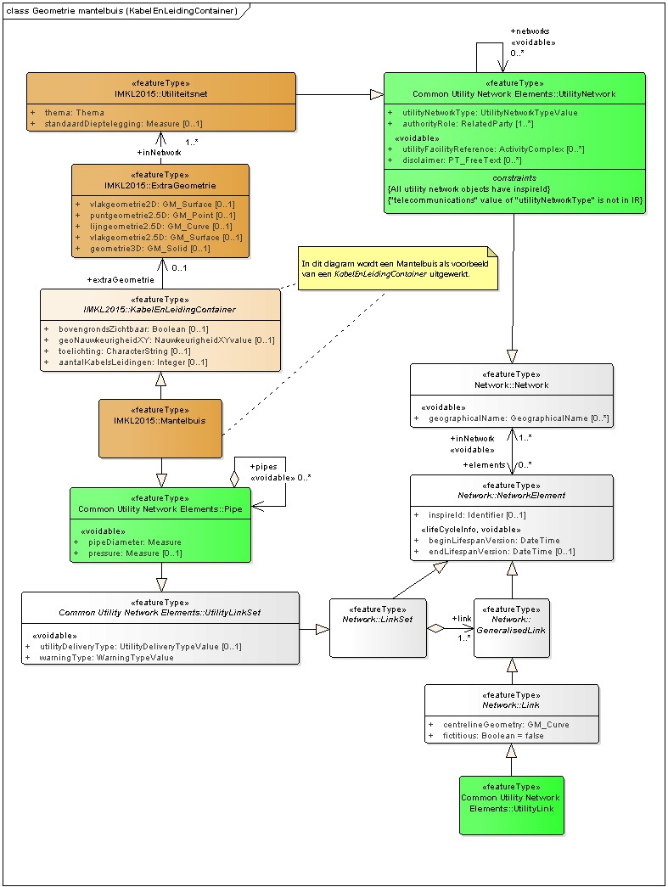
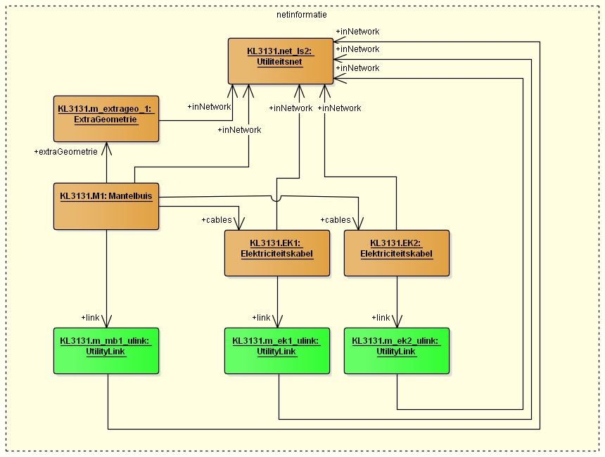

#### Voorbeeld 1. Utiliteitsnet met Mantelbuis en ExtraGeometrie

Een feature _Mantelbuis_ verwijst met een link (naam `link`) naar feature(s) van het type _UtilityLink_, die elk `centrelineGeometry` (type _GM_Curve_) bevat.   
Bovendien staat bij deze features aangegeven tot welk _Utiliteitsnet_ ze behoren door de link `inNetwork`.

Een _Mantelbuis_ is daarnaast een specialisatie van het abstracte type _KabelEnLeidingContainer_.   
Aan een feature die overerft van _KabelEnLeidingContainer_ kan daarnaast met de link `extraGeometrie` verwijzen naar een feature _ExtraGeometrie_.   
Het feature _ExtraGeometrie_ kent verschillende geometrie-attributen, waarvan momenteel alleen het attribuut `vlakGeometrie2D` (type _GM_Surface_) door KLIC wordt ondersteund.   
Ook van het feature _ExtraGeometrie_ moet worden aangegeven tot welk _Utiliteitsnet_ (momenteel maximaal 1 netwerk) deze behoort door de link `inNetwork`.

In bijgevoegd diagram is een uitsnede uit IMKL v1.2.1 gemaakt met de relevante features.

**Let wel**

Een mantelbuis wordt in de kaart al gevisualiseerd als een buis (“buffer” om de centreline-geometrie), in de kleur van het IMKL-thema van het netwerk waar deze naar refereert.

Voor de bufferbreedte wordt daarbij geen rekening gehouden met de daadwerkelijke `pipeDiameter`.
Als aan de mantelbuis ook nog ExtraGeometrie wordt gekoppeld, wordt ook deze (als polygoon) gevisualiseerd!

Voorbeeld van een FeatureCollection met een _Mantelbuis_ en _ExtraGeometrie_: zie   
Voorbeeld 1. Utiliteitsnet met Mantelbuis en ExtraGeometrie.xml

In onderstaande bijlage wordt het objectenmodel van de gebruikte features weergegeven.

